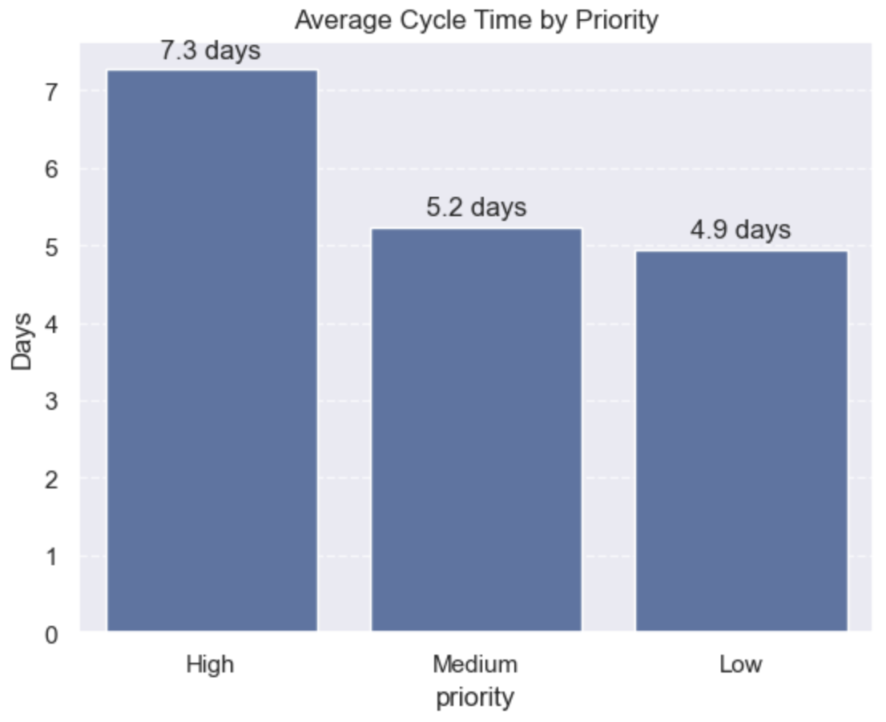
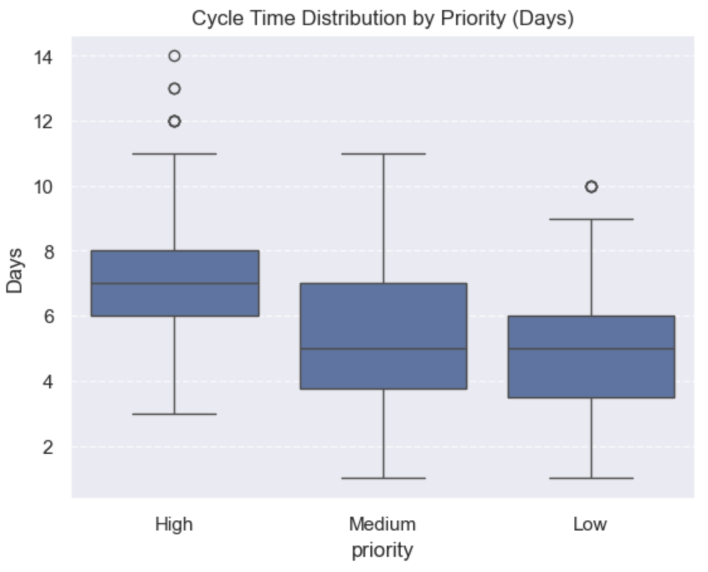

# Atlassian Case Study: Improving Sprint Efficiency and Ticket Resolution Performance

## 📊 Overview
This project analyzes simulated Jira-style ticket data to identify inefficiencies in sprint performance, ticket resolution, and workload distribution.

The goal is to generate data-driven insights to improve engineering productivity and workflow efficiency.

---

## ❓ Business Questions
- Which tickets take the longest to resolve?
- Do reopened tickets increase cycle time?
- Are workloads evenly distributed across engineers?
- Are some teams less efficient than others?

---

## 🛠️ Tools Used
- Python (Pandas, NumPy)
- Matplotlib & Seaborn
- Jupyter Notebook

---

## 🔍 Key Insights
- High-priority tickets showed longer and more variable resolution times
- Reopened tickets significantly increased cycle time
- Workload distribution across engineers was uneven
- Some teams consistently had higher cycle times, indicating bottlenecks

---

## 💡 Recommendations
- Implement workload-aware ticket assignment
- Improve ticket clarity and QA processes
- Monitor team-level performance metrics
- Use historical data to improve sprint planning

---

## 📈 Sample Visuals

### Cycle Time by Priority

### Team Performance

### Distribution Analysis

---

## 📁 Project Structure
- `notebooks/` → full analysis notebook  
- `data/` → simulated dataset  
- `images/` → visual outputs  

---

## 🧠 Conclusion
This case study demonstrates how data analysis can be used to identify inefficiencies in engineering workflows and support better decision-making.

If implemented, these insights could improve sprint efficiency, reduce delays, and enhance overall developer productivity.
